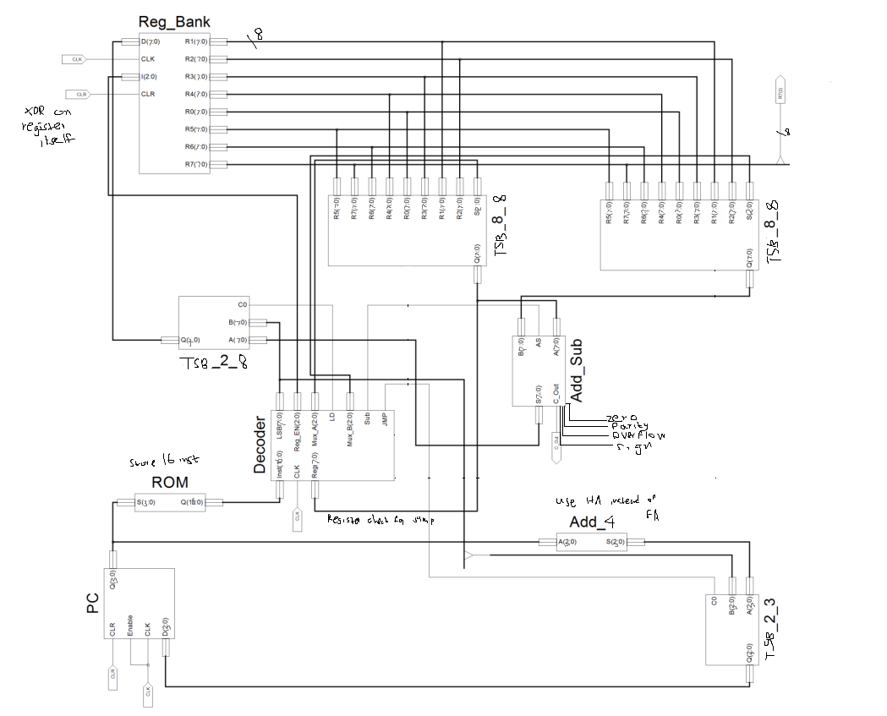

# Nano processor

Project for 17-S2-CS2052

## Design Diagram

## Instruction Expected To Implement

| Instruction | Op Code                                                      | Description                   |
| ----------- | ------------------------------------------------------------ | ----------------------------- |
| MOVI R, d   | Move immediate value d to register R, i.e., R =  d           | 1 0 R R R 0 0 0 d d d d       |
| ADD Ra, Rb  | Add values in registers Ra and Rb and store the result in Ra, i.e., Ra = Ra + Rb | 0 0 Ra Ra Ra Rb Rb Rb 0 0 0 0 |
| NEG R       | 2’s complement of registers R, i.e., R = -R                  | 0 1 R R R 0 0 0 0 0 0 0       |
| JZR R, d    | Jump if value in register R is 0, i.e., If R == 0
        PC = d;
Else
        PC = PC + 1; | 1 1 R R R 0 0 0 0 d d d       |

